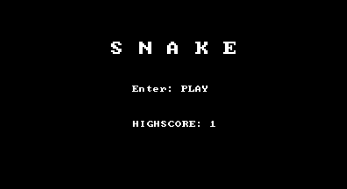

## Developing games on Typescript and Phaser

[Demo](https://uc137.github.io/ts-games/)

## Screenshot


### Installing

Install the dependencies with this command-line:

```
npm install
```
> If you use yarn just replace `npm` with `yarn`

### Building and Running

Perform a quick build (bundle.js) and start server:

```
npm run dev
```
> If you use yarn just replace `npm` with `yarn`
